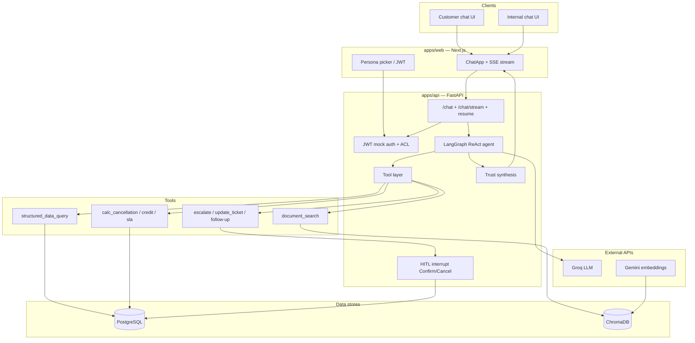

# ParcelPilot Assist

**Demo:** [http://13.233.45.207:3000](http://13.233.45.207:3000)

AI support agent for **ParcelPilot** (B2B logistics), built for the CalQuity AI Agent Assessment.

Customer and internal users can ask natural-language questions about orders, cancellations, service credits, SLAs, and policies. The system answers only from the supplied data pack, enforces account access in the **tool layer**, shows which tools ran, and requires **human confirmation** before write actions (escalation, ticket update, follow-up).

---

## Features

- **Dual chat**: customer (account-scoped) and internal (support / ops)
- **Tools**: `document_search`, `structured_data_query` (lookups + calculators), `create_escalation`, `update_ticket`, `create_follow_up_task`
- **Trust**: agreement overrides SOP/policy; conflict notes; citations; abstain when facts are missing
- **HITL**: confirm / cancel bar before any mutating action
- **Streaming UI**: live “tools called” panel while the agent works
- **Mock auth**: JWT personas (4 customers + Maya + Ops Lead)

**Snapshot clock (authoritative “now”):** `2026-08-16 11:00 Asia/Kolkata`

---

## Stack


| Layer           | Choice                                          |
| --------------- | ----------------------------------------------- |
| Frontend        | Next.js (App Router) + TypeScript               |
| API / agent     | FastAPI + LangGraph (ReAct)                     |
| LLM             | Groq (`openai/gpt-oss-20b`)                     |
| Embeddings      | Google Gemini (`gemini-embedding-001`, 768-dim) |
| Structured data | PostgreSQL (e.g. Supabase)                      |
| Documents       | ChromaDB (local persist) + PDF chunking         |


---

## Architecture




Request flow: UI streams chat → FastAPI → LangGraph agent (Groq) → ACL-gated tools → Postgres / Chroma → trust synthesis on the final answer. Write tools pause at HITL until Confirm/Cancel.

---

## Repository structure

```text
parcel-pilot-ai/
├── README.md
├── IMPLEMENTATION_NOTES.md      # Longer phase-by-phase notes
├── apps/
│   ├── api/                     # FastAPI + LangGraph
│   │   ├── app/
│   │   │   ├── agent/           # Graph, prompts, tool bindings
│   │   │   ├── auth/            # JWT personas, ACL
│   │   │   ├── db/              # SQLAlchemy models / session
│   │   │   ├── embeddings/      # Gemini embed client
│   │   │   ├── ingest/          # Excel + PDF/Chroma ingest
│   │   │   ├── routes/          # auth, chat, tools, actions, data
│   │   │   ├── tools/           # Search, structured query, calculators, writes
│   │   │   ├── trust/           # Confidence / conflicts / citations
│   │   │   └── vector/          # Chroma store + metadata filters
│   │   ├── tests/
│   │   ├── requirements.txt
│   │   └── .env.example
│   └── web/                     # Next.js App Router
│       ├── src/
│       │   ├── app/             # Home + customer/internal chat pages
│       │   ├── components/      # ChatApp UI
│       │   └── lib/             # Auth, stream, types
│       ├── package.json
│       └── .env.example
├── Data/                        # Candidate PDFs + assessment xlsx
├── packages/shared/             # Shared notes / types placeholder
└── tests/golden/                # Golden eval scenario notes
```

---

## Prerequisites

- **Python 3.11+** (3.12/3.14 also work if dependencies install)
- **Node.js 20+**
- **PostgreSQL** (local or Supabase) — connection string in `DATABASE_URL`
- API keys:
  - [Groq](https://console.groq.com/) — `GROQ_API_KEY` (optional `GROQ_API_KEY_2` for rate-limit fallback)
  - [Google AI Studio / Gemini](https://aistudio.google.com/) — `GEMINI_API_KEY`

---

## Setup and run (local)

### 1. Clone

```bash
git clone https://github.com/srijan-op/parcel-pilot-ai.git
cd parcel-pilot-ai
```

### 2. Backend (`apps/api`)

```powershell
cd apps/api
py -3 -m venv .venv
.\.venv\Scripts\activate          # Windows

pip install -r requirements.txt
copy .env.example .env            # Windows
```

Edit `apps/api/.env`:


| Variable                      | Purpose                                                  |
| ----------------------------- | -------------------------------------------------------- |
| `GROQ_API_KEY`                | Agent LLM                                                |
| `GROQ_API_KEY_2`              | Optional fallback on 429 / TPM limits                    |
| `GEMINI_API_KEY`              | Embeddings                                               |
| `DATABASE_URL`                | Postgres (URL-encode special characters in the password) |
| `DATA_PATH`                   | Path to data pack (default `../../Data` or `../../data`) |
| `CHROMA_PATH`                 | Vector index directory (default `./.chroma`)             |
| `CORS_ORIGINS`                | Frontend origin(s), e.g. `http://localhost:3000`         |
| `JWT_SECRET`                  | Mock auth signing secret                                 |
| `SNAPSHOT_AT` / `SNAPSHOT_TZ` | Assessment clock (defaults match the data pack)          |


**Load structured data** (Excel → Postgres):

```powershell
python -m app.ingest
```

Expected counts: accounts 4, orders 6, tickets 7, documents 6.

**Build the document index** (PDFs → Chroma + Gemini embeddings):

```powershell
python -m app.ingest.chroma
```

**Start the API:**

```powershell
uvicorn app.main:app --reload --port 8000
```

- Health: [http://localhost:8000/health](http://localhost:8000/health)  
- OpenAPI: [http://localhost:8000/docs](http://localhost:8000/docs)

**Reset demo data** after HITL writes (ticket updates, escalations):

```powershell
python -m app.ingest
```

(Re-upserts accounts/orders/tickets from the Excel pack. Chat threads clear on browser refresh; LangGraph memory is in-process.)

### 3. Frontend (`apps/web`)

```powershell
cd apps/web
npm install
copy .env.example .env.local
```

`apps/web/.env.local`:

```env
NEXT_PUBLIC_API_URL=http://localhost:8000
```

```powershell
npm run dev
```

Open [http://localhost:3000](http://localhost:3000) — pick **Customer** or **Internal**, choose a persona, then chat.

### 4. Tests (API)

```powershell
cd apps/api
.\.venv\Scripts\activate
pytest
```

---

## How to use the app

1. Home → **Customer chat** or **Internal chat**
2. Select a persona (e.g. Northstar / Maya)
3. Ask questions; expand **tools called** on assistant messages
4. For write actions, use **Confirm** / **Cancel** above the composer (nothing is written until Confirm)

### Example questions


| Persona    | Question                                          |
| ---------- | ------------------------------------------------- |
| Northstar  | Can I cancel ORD-1001 without a cancellation fee? |
| Northstar  | Cancel ORD-1002?                                  |
| LumenWorks | Show me the service credit for ORD-2002.          |
| Beacon     | What’s the status of ORD-1001? (expect ACL deny)  |
| Maya       | Check SLA on TKT-501 and escalate if breached.    |


More scenarios: see assessment golden cases (cancel fees, credits, SLA, KI-208/211, HITL confirm).

---

## 4. Architecture note

### Agent design

The agent is a **LangGraph ReAct loop** backed by Groq (`openai/gpt-oss-20b`). Each chat turn gets a system prompt scoped to the signed-in persona: role, account scope, the fixed assessment snapshot clock, and a catalog of available documents. The model decides which tools to call and in what order; the API streams token output plus tool-start and tool-end events so the UI can show live progress.

Write paths (`create_escalation`, `update_ticket`, `create_follow_up_task`) use LangGraph **`interrupt()`**. The graph pauses with a draft payload; the client resumes with Confirm or Cancel via `/chat/resume` (and stream variants). The agent is instructed not to claim a write succeeded until the resume path returns a result reference.

Groq rate limits are handled with an optional second API key (`GROQ_API_KEY_2`) that retries on 429 / TPM errors.

### Tool design

Five agent-facing tools, with ACL enforced **inside the tool layer** (not only in the prompt):

| Tool | Role |
| ---- | ---- |
| `document_search` | RAG over policies, SOPs, agreements, and known-issue PDFs (metadata-filtered by authority and account) |
| `structured_data_query` | Lookups (`get_order`, `get_ticket`, `list_*`) and calculators (`calc_cancellation`, `calc_service_credit`, `calc_sla`) |
| `create_escalation` | Propose escalation → HITL → write + audit |
| `update_ticket` | Propose ticket change → HITL → write + audit |
| `create_follow_up_task` | Propose follow-up task → HITL → write + audit |

Customers are scoped to their `account_id`; internal personas can query across accounts. Calculators return structured JSON so fees, credits, and SLA windows are deterministic rather than LLM arithmetic.

### Document and structured-data handling

**Documents:** PDFs are chunked with section awareness, embedded with Gemini (`gemini-embedding-001`, 768-dim), and stored in Chroma with metadata (`doc_type`, `status`, `authority_rank`, `account_id`). Search applies filters so deprecated policy (e.g. Support Policy v2) is indexed but demoted from default “current policy” answers.

**Structured data:** The assessment Excel pack is ingested into Postgres (accounts, orders, tickets, document registry). All time-based eligibility (SLA breach, cancellation windows, booking age) uses the configured snapshot clock (`2026-08-16 11:00 Asia/Kolkata`), not wall-clock time.

### Source reliability and conflict handling

Source precedence is explicit: **signed customer agreement > current policy/SOP > product docs**. Historical tickets are treated as context only and may be wrong (e.g. misguided guidance on TKT-450).

After each agent turn, **trust synthesis** inspects tool traces and attaches citations, conflict notes when sources disagree, and flags such as abstain, manager approval recommended, or escalation recommended. When an agreement overrides SOP (Northstar cancellation fee ₹0 vs SOP ₹250), the answer and trust block call that out directly instead of silently picking one source.

### Major technical trade-offs

| Choice | Why |
| ------ | --- |
| Groq + Gemini split | Keeps free-tier viable; chat and embeddings on providers suited to each job |
| Calculators in tools | Reliable money and SLA math; reduces hallucinated fees |
| In-memory LangGraph checkpointer | Simple for demo; thread state clears on API restart (Postgres mutations persist separately) |
| Chroma on API disk / Docker volume | Low ops overhead for assessment; re-ingest on fresh hosts |
| Mock JWT personas | Meets role/account requirements without building a full IdP |
| HITL on all writes | Safer demo and closer to real support workflows; adds a resume step in the API |

---

## 5. Product note

### Additional client problem addressed

I chose **Problem 2 — trust and reliability under imperfect sources**.

ParcelPilot support must answer from agreements, SOPs, deprecated policy, product docs, and ticket history that can disagree. A plain RAG chatbot would either blend sources or pick one arbitrarily. This submission addresses that with: tool-gated facts, explicit precedence rules, conflict surfacing in the trust block, and abstain/escalate behavior when required fields are missing (e.g. unknown `carrier_fault` on a credit question).

### What else I would build for ParcelPilot

- **Proactive ops dashboard (Problem 1):** surface SLA breaches, stale tickets, and account-level risk before customers ask — fed by the same Postgres + policy rules.
- **Persistent conversation history** and agent handoff for support teams.
- **Eval harness** against golden scenarios (G1–G17) in CI, plus regression checks after prompt or tool changes.
- **Elastic IP / domain + TLS** for stable hosted demos and stricter CORS.

### Intentionally left out of this submission

- Real SSO / production identity provider (mock JWT personas only).
- Multi-tenant billing, carrier integrations, and live shipment tracking APIs.
- Automated ticket resolution without HITL — all writes require Confirm.
- Full ops dashboard and batch anomaly detection (described above as follow-on, not shipped).
- Confidence badge in the UI (trust metadata remains in the trust block; display simplified for clarity).

### Metric for product usefulness

**Resolution rate without human correction** — for a sampled set of support conversations, the share where the agent’s final answer (including calculator results and cited policy) matches what a support lead would approve *and* no write action required rollback or override. I would segment this by persona (customer vs internal) and by query type (lookup vs policy vs calculator vs write).

---

## 6. AI tool usage

I used **Cursor** as an AI coding assistant throughout the project. It helped with scaffolding, boilerplate, and faster iteration on implementation details — things like API routes, Docker setup, UI wiring, and test stubs.

The overall direction — agent architecture, tool boundaries, trust/HITL behavior, and how customer vs internal flows should work — came from my own design choices against the assessment brief. I used the assistant to explore options, sanity-check trade-offs, and combine those ideas into working code, then reviewed and adjusted what it produced (including running `pytest` and manual demo checks) before treating it as final.

---

## Hosted application


| Service | URL                                                    |
| ------- | ------------------------------------------------------ |
| Web     | [http://13.233.45.207:3000](http://13.233.45.207:3000) |
| API     | [http://13.233.45.207:8000](http://13.233.45.207:8000) |


---

## Demo video

*TBD — ~5 minutes covering architecture, live demo, and key decisions.*

---

## License / assessment

Built as a take-home assessment submission. Use only the supplied ParcelPilot data pack for answers; do not connect external live logistics systems.