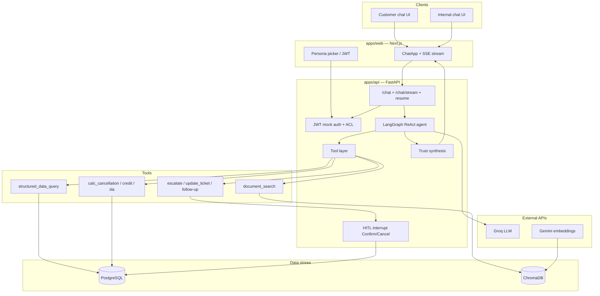

# ParcelPilot Assist

AI support agent for **ParcelPilot** (B2B logistics), built for the CalQuity AI Agent Assessment.

Customer and internal users can ask natural-language questions about orders, cancellations, service credits, SLAs, and policies. The system answers only from the supplied data pack, enforces account access in the **tool layer**, shows which tools ran, and requires **human confirmation** before write actions (escalation, ticket update, follow-up).

---

## Features

- **Dual chat**: customer (account-scoped) and internal (support / ops)
- **Tools**: `document_search`, `structured_data_query` (lookups + calculators), `create_escalation`, `update_ticket`, `create_follow_up_task`
- **Trust**: agreement overrides SOP/policy; conflict notes; citations; abstain when facts are missing
- **HITL**: confirm / cancel bar before any mutating action
- **Streaming UI**: live “tools called” panel while the agent works
- **Mock auth**: JWT personas (4 customers + Maya + Ops Lead)

**Snapshot clock (authoritative “now”):** `2026-08-16 11:00 Asia/Kolkata`

---

## Stack


| Layer           | Choice                                          |
| --------------- | ----------------------------------------------- |
| Frontend        | Next.js (App Router) + TypeScript               |
| API / agent     | FastAPI + LangGraph (ReAct)                     |
| LLM             | Groq (`openai/gpt-oss-20b`)                     |
| Embeddings      | Google Gemini (`gemini-embedding-001`, 768-dim) |
| Structured data | PostgreSQL (e.g. Supabase)                      |
| Documents       | ChromaDB (local persist) + PDF chunking         |


---

## Architecture



Request flow: UI streams chat → FastAPI → LangGraph agent (Groq) → ACL-gated tools → Postgres / Chroma → trust synthesis on the final answer. Write tools pause at HITL until Confirm/Cancel.

---

## Repository structure

```text
parcel-pilot-ai/
├── README.md
├── IMPLEMENTATION_NOTES.md      # Longer phase-by-phase notes
├── apps/
│   ├── api/                     # FastAPI + LangGraph
│   │   ├── app/
│   │   │   ├── agent/           # Graph, prompts, tool bindings
│   │   │   ├── auth/            # JWT personas, ACL
│   │   │   ├── db/              # SQLAlchemy models / session
│   │   │   ├── embeddings/      # Gemini embed client
│   │   │   ├── ingest/          # Excel + PDF/Chroma ingest
│   │   │   ├── routes/          # auth, chat, tools, actions, data
│   │   │   ├── tools/           # Search, structured query, calculators, writes
│   │   │   ├── trust/           # Confidence / conflicts / citations
│   │   │   └── vector/          # Chroma store + metadata filters
│   │   ├── tests/
│   │   ├── requirements.txt
│   │   └── .env.example
│   └── web/                     # Next.js App Router
│       ├── src/
│       │   ├── app/             # Home + customer/internal chat pages
│       │   ├── components/      # ChatApp UI
│       │   └── lib/             # Auth, stream, types
│       ├── package.json
│       └── .env.example
├── Data/                        # Candidate PDFs + assessment xlsx
├── packages/shared/             # Shared notes / types placeholder
└── tests/golden/                # Golden eval scenario notes
```

---

## Prerequisites

- **Python 3.11+** (3.12/3.14 also work if dependencies install)
- **Node.js 20+**
- **PostgreSQL** (local or Supabase) — connection string in `DATABASE_URL`
- API keys:
  - [Groq](https://console.groq.com/) — `GROQ_API_KEY` (optional `GROQ_API_KEY_2` for rate-limit fallback)
  - [Google AI Studio / Gemini](https://aistudio.google.com/) — `GEMINI_API_KEY`

---

## Setup and run (local)

### 1. Clone

```bash
git clone https://github.com/srijan-op/parcel-pilot-ai.git
cd parcel-pilot-ai
```

### 2. Backend (`apps/api`)

```powershell
cd apps/api
py -3 -m venv .venv
.\.venv\Scripts\activate          # Windows

pip install -r requirements.txt
copy .env.example .env            # Windows
```

Edit `apps/api/.env`:


| Variable                      | Purpose                                                  |
| ----------------------------- | -------------------------------------------------------- |
| `GROQ_API_KEY`                | Agent LLM                                                |
| `GROQ_API_KEY_2`              | Optional fallback on 429 / TPM limits                    |
| `GEMINI_API_KEY`              | Embeddings                                               |
| `DATABASE_URL`                | Postgres (URL-encode special characters in the password) |
| `DATA_PATH`                   | Path to data pack (default `../../Data` or `../../data`) |
| `CHROMA_PATH`                 | Vector index directory (default `./.chroma`)             |
| `CORS_ORIGINS`                | Frontend origin(s), e.g. `http://localhost:3000`         |
| `JWT_SECRET`                  | Mock auth signing secret                                 |
| `SNAPSHOT_AT` / `SNAPSHOT_TZ` | Assessment clock (defaults match the data pack)          |


**Load structured data** (Excel → Postgres):

```powershell
python -m app.ingest
```

Expected counts: accounts 4, orders 6, tickets 7, documents 6.

**Build the document index** (PDFs → Chroma + Gemini embeddings):

```powershell
python -m app.ingest.chroma
```

**Start the API:**

```powershell
uvicorn app.main:app --reload --port 8000
```

- Health: [http://localhost:8000/health](http://localhost:8000/health)  
- OpenAPI: [http://localhost:8000/docs](http://localhost:8000/docs)

**Reset demo data** after HITL writes (ticket updates, escalations):

```powershell
python -m app.ingest
```

(Re-upserts accounts/orders/tickets from the Excel pack. Chat threads clear on browser refresh; LangGraph memory is in-process.)

### 3. Frontend (`apps/web`)

```powershell
cd apps/web
npm install
copy .env.example .env.local
```

`apps/web/.env.local`:

```env
NEXT_PUBLIC_API_URL=http://localhost:8000
```

```powershell
npm run dev
```

Open [http://localhost:3000](http://localhost:3000) — pick **Customer** or **Internal**, choose a persona, then chat.

### 4. Tests (API)

```powershell
cd apps/api
.\.venv\Scripts\activate
pytest
```

---

## How to use the app

1. Home → **Customer chat** or **Internal chat**
2. Select a persona (e.g. Northstar / Maya)
3. Ask questions; expand **tools called** on assistant messages
4. For write actions, use **Confirm** / **Cancel** above the composer (nothing is written until Confirm)

### Example questions


| Persona    | Question                                          |
| ---------- | ------------------------------------------------- |
| Northstar  | Can I cancel ORD-1001 without a cancellation fee? |
| Northstar  | Cancel ORD-1002?                                  |
| LumenWorks | Show me the service credit for ORD-2002.          |
| Beacon     | What’s the status of ORD-1001? (expect ACL deny)  |
| Maya       | Check SLA on TKT-501 and escalate if breached.    |


More scenarios: see assessment golden cases (cancel fees, credits, SLA, KI-208/211, HITL confirm).

---

## Architecture note 

### Agent design

- LangGraph **ReAct** agent with a system prompt scoped to the signed-in persona (role, account, snapshot clock, document catalog).
- Tools are bound per request; the model decides call order. Streaming exposes tool start/end events to the UI.
- Write tools use LangGraph `interrupt()` so execution waits for Confirm/Cancel (`/chat/resume` / stream variants).

### Tool design


| Tool                                                            | Role                                                                           |
| --------------------------------------------------------------- | ------------------------------------------------------------------------------ |
| `list_documents`                                                | Optional catalog refresh (catalog also injected in the prompt)                 |
| `document_search`                                               | RAG over policies, SOP, agreements, known issues (ACL-filtered)                |
| `structured_data_query`                                         | `get_`* / `list_*` plus `calc_cancellation`, `calc_service_credit`, `calc_sla` |
| `create_escalation` / `update_ticket` / `create_follow_up_task` | Propose → HITL → execute + audit                                               |


Access control is enforced **inside tools**, not only in the prompt (customers cannot read other accounts).

### Document and structured-data handling

- PDFs: section-aware chunking → Gemini embeddings → Chroma with authority metadata (`status`, `doc_type`, `authority_rank`, `account_id`).
- Excel: accounts, orders, tickets in Postgres; calculators use the snapshot clock for time math.
- Deprecated Support Policy v2 is indexed but demoted / excluded from default “current” answers.

### Source reliability and conflict handling

Precedence: **signed customer agreement > current policy/SOP > product docs**. Historical tickets are context only and may be wrong. Trust synthesis after the agent turn attaches conflicts, citations, and flags (abstain, manager approval, escalation recommended). Agreement overrides (e.g. Northstar cancel fee ₹0 vs SOP ₹250) are called out explicitly.

### Major trade-offs


| Choice                           | Why                                                          |
| -------------------------------- | ------------------------------------------------------------ |
| Groq + Gemini split              | Free-tier friendly; embeddings vs chat providers specialized |
| Calculators in tools             | Deterministic fees/SLA/credits instead of LLM arithmetic     |
| In-memory LangGraph checkpointer | Simple for demo; restart clears threads (DB is separate)     |
| Chroma on API disk               | Simple local RAG; re-ingest on fresh hosts                   |
| Mock JWT personas                | Meets assessment auth without a real IdP                     |


---

## Product note (short)

### Additional client problem addressed

**Trust and reliability (Problem 2):** imperfect sources, agreement vs SOP conflicts, deprecated policy, and historical misguidance (e.g. TKT-450) are handled with precedence rules, conflict notes, and abstain/escalate behavior—not a single undifferentiated RAG dump.

*(Proactive ops dashboard / issue detection is planned as Problem 1 stretch; core chat + trust + HITL ship first.)*


---

## AI tool usage

Developed with **Cursor** (AI-assisted coding) for scaffolding, tool/ACL wiring, LangGraph HITL, and UI. Design decisions, trust rules, and calculators were specified against the assessment brief and data pack; generated code was reviewed and tested locally.

---

## Hosted application


| Service | URL |
| ------- | --- |
| Web     |     |
| API     |     |


---

## Demo video

*TBD — ~5 minutes covering architecture, live demo, and key decisions.*

---

## License / assessment

Built as a take-home assessment submission. Use only the supplied ParcelPilot data pack for answers; do not connect external live logistics systems.